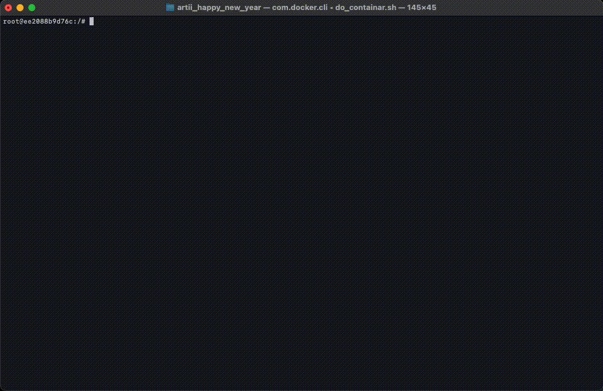

# Happy New Year 2024
## Introduction
This repository contains a simple set of commands to enhance your New Year celebration. Follow the instructions below to add some fun and creativity to your festivities.

## Instructions
1. Build Docker Image
Execute the following command to build the necessary Docker image:

~~~sh
docker build -t artii-lolcat-im .  
~~~

2.  Run Docker Container
Run the following command to create and enter a Docker container for printing New Year messages:

~~~sh
docker run --name print-new-year-2024 \
    --rm \
    -it artii-lolcat-im \
    /bin/bash
~~~

3. Display a Festive Message
Next, use the following command to display a colorful "Happy New Year 2024!" message in your terminal:

~~~sh
artii "Happy New Year 2024 !" | lolcat
~~~

Feel free to customize the message within the quotes to suit your celebration theme.

4. Record Your Screen
To record your screen, use the shortcut `Shift + Command + 5` to initiate the screen recording feature.

5. Create a GIF from a Video
If you have a video file named happyNewYear2024.mov and want to convert it into a GIF, use the following command:

~~~sh
ffmpeg -i happyNewYear2024.mov -r 30 happyNewYear.gif
~~~

Make sure to replace happyNewYear2024.mov with the actual name of your video file. The resulting GIF, named happyNewYear.gif, will be created with a frame rate of 30 frames per second.

